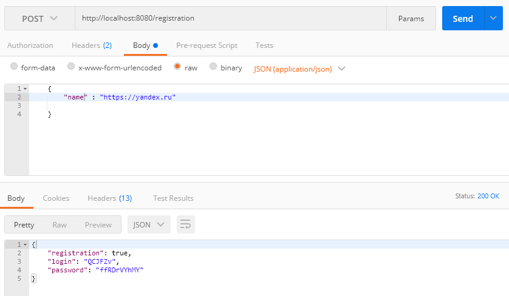
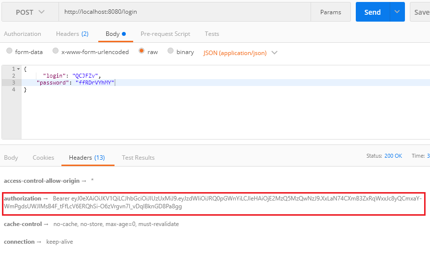
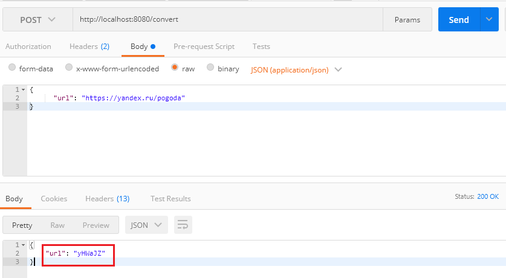
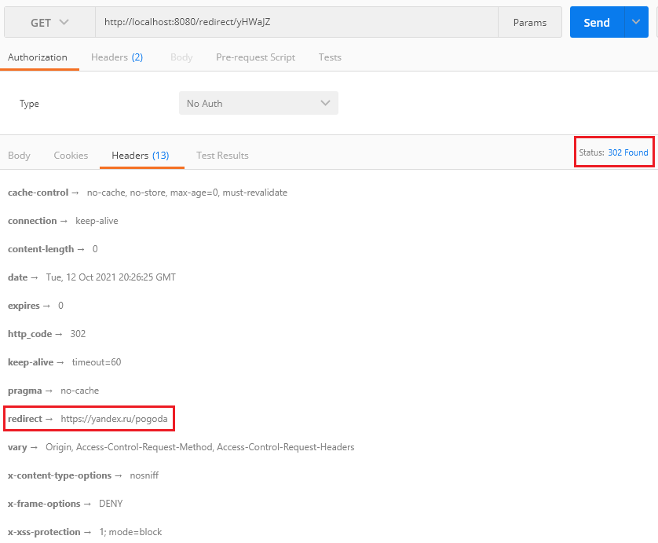
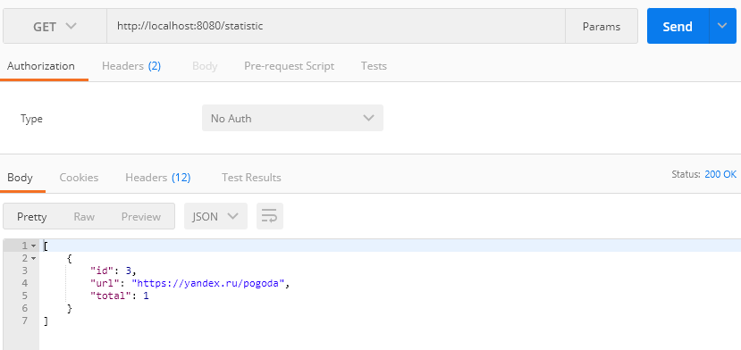

# UrlShortCut
 Разработанный web сервис работает через REST API, который позволяет преобразовывать URL на более короткий вариант и в дальнейшем преобразовывать URL в исходный вид.  
 ### Регистрация
 Сервисом могут пользоваться разные сайты. Каждому сайту выдается пароль и логин. Чтобы зарегистрировать сайт в систему нужно отправить URL Post запрос ( http://localhost:8080/registration ) с телом JSON объекта ({site : "URL_Сайта"}). 
      
 В ответе сервис отправляет следующую информацию {registration : true/false, login: УНИКАЛЬНЫЙ_КОД, password : УНИКАЛЬНЫЙ_КОД}, Флаг registration указывает, что регистрация выполнена или нет, то есть сайт уже в системе или нет, и соответственно логин и пароль для дальнейшей авторизации.     
 ### Авторизация
Во всех остальных вызовах сервис проверяет авторизацию пользователя. Авторизацию сделана через JWT. Пользователь отправляет POST запрос ( http://localhost:8080/login ) с login и password и получает ключ. Этот ключ отправляет в запросе в блоке HEAD.  
      
 ### Регистрация URL
Поле того, как пользователь зарегистрировал свой сайт и авторизовался, он может отправлять на сервис url и получать сокращённый вариант. Пользователь должен отправить на сервис Post запрос ( http://localhost:8080/convert ) с телом запроса {url: "URL_САЙТА"}
      
Сервис отправляет ответ пользователю с телом JSON объекта {url: "СОКРАЩЁННЫЙ_URL"}
 ### Переадресация
 Переадресация выполняется без авторизации. При обращении к сервису Get запросом ( http://localhost:8080/redirect/{СОКРАЩЁННЫЙ_URL} ), то ответ от сервиса будет иметь статус 302 и иметь оригинальный URL адрес для переадресации.  
      
 ### Статистика
В сервисе считается количество вызовов каждого зарегистрированного адреса. По сайту можно получить статистку всех адресов и количество вызовов этого адреса. Для получения статистики необходимо обратиться к сервису Get запросом ( http://localhost:8080/statistic ).
      

#### Инструменты:
В данном проекте использовались следующие инструменты:      
1) IntelliJ Idea    
2) Maven        
3) PostgreSQL      
4) Postman      

